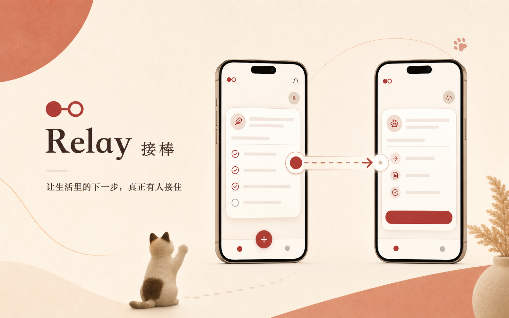

# Relay（接棒）

> 让生活里的下一步，由说好的人继续推进。



Relay 是一个面向女性黑客松的移动优先交互原型。它把一件需要他人参与的生活事务整理成清楚的事项包，并持续回答一个普通聊天和待办工具容易丢失的问题：**现在由谁推进下一步？**

主演示讲述林然临时出差，请朋友小雨接住“带布丁完成复诊”的执行。小雨可以无需账号查看请求、接受或婉拒；一旦接受，责任轨道会明确移动到小雨，同时把手术、住院、治疗方案和重大费用等决定保留给林然。

## 体验入口

- [双手机路演舞台](https://relay-p0-demo.vercel.app/demo)：双手机视图与确定性控制器
- [林然的“今天”视图](https://relay-p0-demo.vercel.app/)：移动端发起者体验
- [小雨的单事项视图](https://relay-p0-demo.vercel.app/r/demo-cat-checkup)：无账号协作者体验

## P0 能力

- 有边界的责任接棒：确认事项、预览分享、接受、婉拒与完成
- 单一确定性状态源：React Context + `useReducer`
- 本地持久化与同源同步：`localStorage` + `BroadcastChannel`
- 可解释的责任轨道：人物、端点、实心责任点和持久状态文案
- Warm Editorial 视觉系统与约 680ms 的责任转移动效
- 375px 移动端、1440×900 路演舞台和减少动态效果支持
- 无数据库、无账号、无运行时 AI、无远程字体，黄金路径不依赖网络

## 本地运行

```bash
npm install
npm run dev
```

完整质量门禁：

```bash
npm run verify
npm run test:golden
```

`npm run verify` 覆盖 ESLint、TypeScript、Vitest、生产构建和 Playwright E2E；`npm run test:golden` 会从确定性重置连续运行十次完整接棒路径。

## 技术边界

这是用于证明交互与产品语义的 P0 原型，不宣称真实跨设备协作。`/r/demo-cat-checkup` 只在同源浏览上下文中模拟分享；生产级身份、权限、撤回、令牌和远程同步属于后续阶段。

详细产品与架构决策见 [`docs/handoff/relay-p0-context-pack.md`](./docs/handoff/relay-p0-context-pack.md) 和 [`docs/adr/ADR-001-demo-first-architecture.md`](./docs/adr/ADR-001-demo-first-architecture.md)。
