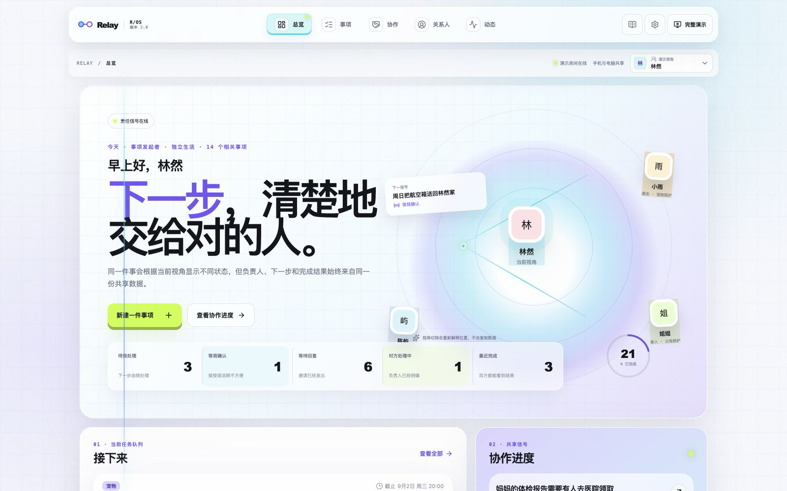

# Relay

> 把自然语言里的复杂事项，整理成负责人、下一步、完成标准和决策边界都清楚的协作流程。



Relay 是一个移动优先的完整交互 Demo。它不是单独的路演页面：总览、事项、协作、关系人、动态、设置和 Agent 创建都读取同一份工作区数据，用户可以真实点击、创建、邀请、确认、调整、完成和回看结果。

它解决的是聊天工具难以长期维护的结构化协作问题。聊天消息可以表达意图，但“现在由谁处理、下一步到底是什么、做到什么算完成、什么情况必须先联系发起者”很容易随对话滚动而丢失。Relay 把这些信息保留为可执行、可追踪的事项，同时仍允许参与者接受、提出调整或拒绝邀请。

## 在线体验

- [最新完整 Demo](https://relay-p0-demo.vercel.app/)：蓝紫色 Relay Signal OS 工作台，支持电脑和手机浏览器
- [Agent 创建事项](https://relay-p0-demo.vercel.app/matters/new)：用自然语言生成可确认的多步骤计划
- [公开协作视图](https://relay-p0-demo.vercel.app/r/demo-cat-checkup)：无需账号体验接受、处理与完成结果

## 当前能力

- 完整事项管理：新建、编辑、搜索、状态筛选、邀请协作、提出调整、拒绝、完成与重新打开
- 四种用户视角：右上角可切换林然、小雨、姐姐和陈屿，观察同一份数据在不同责任位置下的变化
- MiniMax 协作 Agent：把复杂描述拆成每个都能独立完成和确认的步骤，发现阻塞信息时一次只追问一个问题
- 人工决策边界：Agent 只生成草案；发起者确认后才创建事项，受邀人仍需亲自回应
- 真实预制数据：14 条跨宠物、家人、住房、行政、伴侣和旅行场景的共享事项及活动记录
- 本地持久化与同源同步：`localStorage`、`BroadcastChannel` 和 storage event
- 响应式界面：针对 375×812 手机和 1440×900 桌面完成视觉与交互验证
- 离线核心流程：页面加载后，非 Agent 的事项协作黄金路径可在断网状态完成

## 本地运行

```bash
npm install
cp .env.example .env.local
npm run dev
```

只在 `.env.local` 中填写服务端 `MINIMAX_API_KEY`。密钥不会进入浏览器 bundle、Git 历史或截图。MiniMax 未配置或暂时失败时，Relay 会保留原输入供用户重试，不会用本地模板伪造计划。

构建后的完整 Node 演示服务：

```bash
npm run build
npm run serve
```

质量门禁：

```bash
npm run verify
npm run test:golden
```

`npm run verify` 覆盖 ESLint、严格 TypeScript、Vitest、生产构建与 53 条 Playwright E2E；场景矩阵包含 10 个场景、30 条独立用户用例。`npm run test:golden` 连续运行十次完整产品路径和十次离线路径。

## 演示边界

当前版本没有数据库、账号或生产级权限系统。浏览器中的事项数据保存在本机；本地单进程 Node 服务可以为受控路演提供临时电脑/手机共享房间，但 Vercel 版本不宣称跨设备持久同步。生产化仍需要身份、访问控制、持久数据库、冲突处理、速率限制和审计。

详细决策见 [context pack](./docs/handoff/relay-p0-context-pack.md)、[ADR-005](./docs/adr/ADR-005-single-workspace-lifecycle.md) 和 [ADR-006](./docs/adr/ADR-006-text-coordination-agent.md)。
